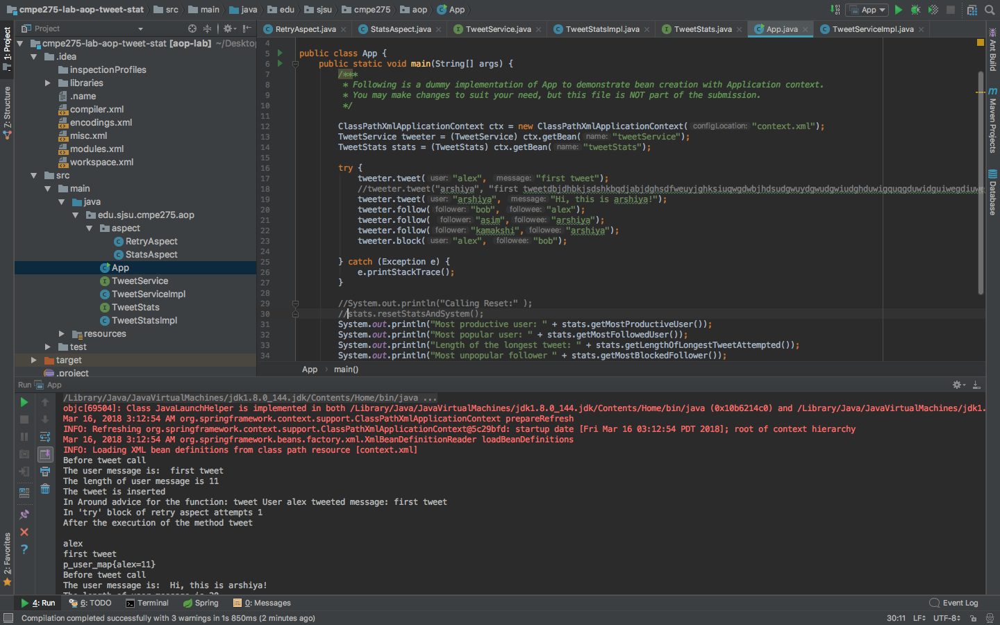
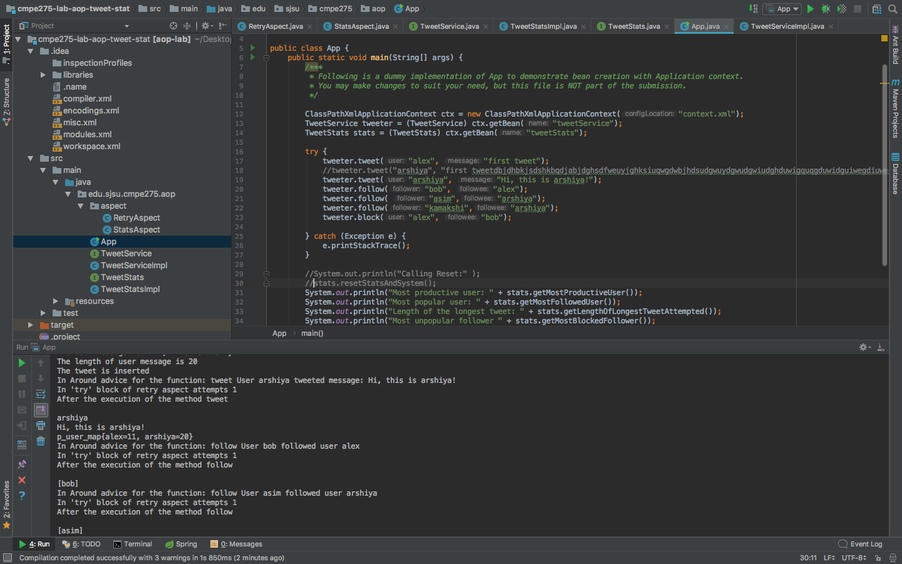
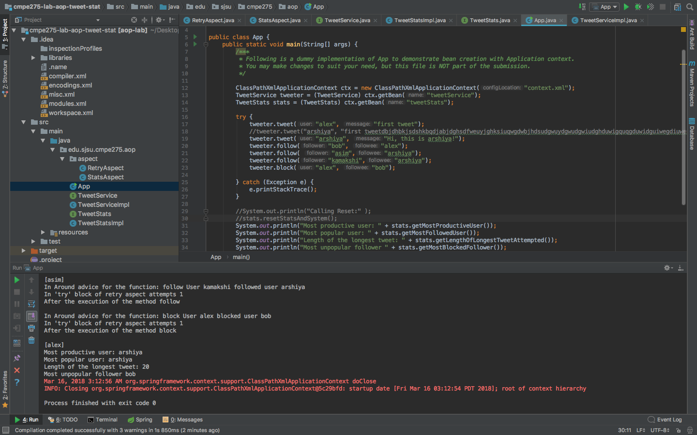

# MiniTwitter
Mini Twitter application using technologies: 

• Spring  
• AOP  
• Advices 

Features: 

• Stores the tweet length along with user in treemap.  
• Displays tweet on console.  
• Displays the longest tweet attempted (including the failed ones).  
• Displays the most productive user (based on total length of tweets).  
• Displays the most blocked(unpopular) user.  
• Displays the most followed(popular) user.  

Steps to run the application:

1. Open the project in IntelliJ.
2. Click on Run button on the top right corner.

Below are some screenshots demonstrating the application:

### Console showing the activities:

